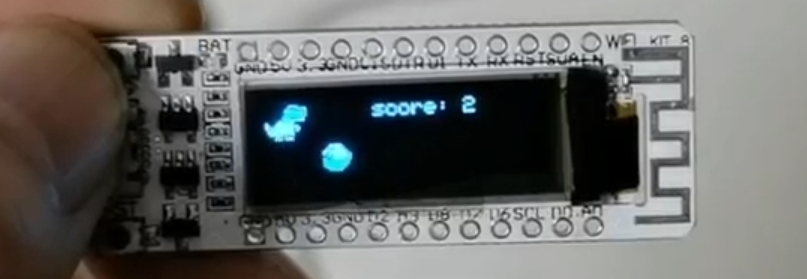

# A dinosaur game emulates GoogleChromeNoInternet game.

Google Chorme offers a Dinosaur Game when NoInternet happens. That shows a dinosaur overcoming the cactuses in desert.
This game is based on the wiki_kit_8 board that has two buttons and an 0.91inch oled screen.
The two buttons are for restart and jump the dinosaur. The oled displays the game.
If you like this game, any contributions are welcomed.

## Hardware

ESP8266 driven board `wifi_kit_8` dev by Heltech Co. Ltd. in Chengdu.

## Software library depends

ESP8266_Arduino core
Adafruit_SSD1306
More details, see the `platformio.ini`

## Implementing steps and labour amount:

1. basic display and bitMaps data preparation. --49%
2. interrupt on the pin for button_jump -- 1%
3. dinosaur and monster moving beats. display them with `millis() - last_millis > threshold`. --20%
4. add jumping regulator for jump height vary. --10%
5. add instructions for game over. --5%
6. add collision judgement function. --15%

## todo list:

 -[x] add speed various for monster moving, delta_speed = score/15 or vary the beatTime1 by value of score.
 -[ ] Write the highest score in SNIFFS or LITTLEFS, and display it when game over.
 -[ ] Make a cool animation for the occurency of new high score record.
 -[ ] write the code into .cpp & .h files to make them clear.
 -[ ] add non-source beeper and music for this game.
